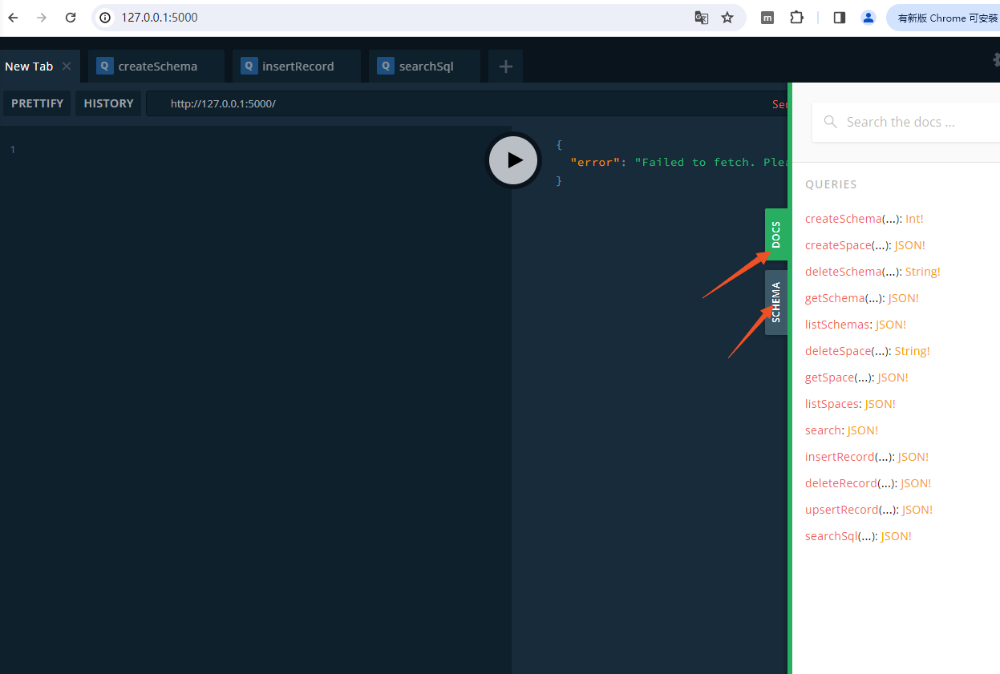
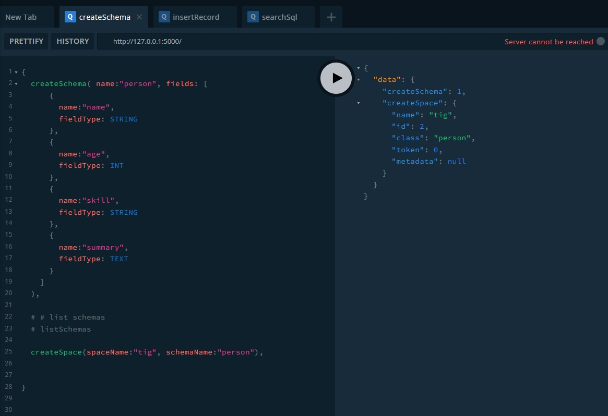
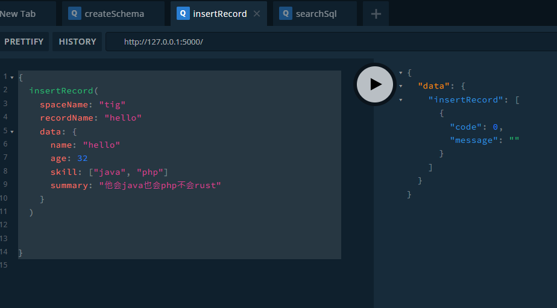
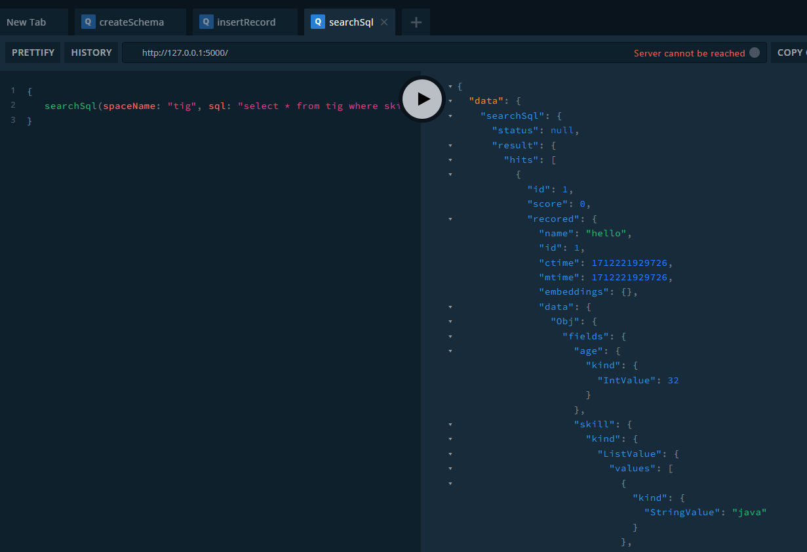

在項目根目錄下执行 `cargo run`

打开浏览器

<http://127.0.0.1:5000/>



第一步创建schema，和space

```` graphql
{
  createSchema( name:"person", fields: [
      {
        name:"name",
        fieldType: STRING
      },
      {
        name:"age",
        fieldType: INT
      },
      {
        name:"skill",
        fieldType: STRING
      },
      {
        name:"summary",
        fieldType: TEXT
      }
    ]
  ),
  
  # # list schemas
  # listSchemas
  
  createSpace(spaceName:"tig", schemaName:"person"),
  
}

````

执行结果如下


插入数据

````graphql
{
  insertRecord(
    spaceName: "tig"
    recordName: "hello"
    data: {
      name: "hello"
      age: 32
      skill: ["java", "php"]
      summary: "他会java也会php不会rust"
    }
  ) 
}
````

执行结果如下


查询

````graphql
{
   searchSql(spaceName: "tig", sql: "select * from tig where skill='java' and summary='php'")
}
````



### TODOLIST

#### core

* 全文索引
  * 大小写转换，
  * 词干提取
  * 多音字，拼音转换
  * ProximitySearch
  * bm25
* 向量索引
  * 一个字段多向量支持
  * embedding向量拆分到document之外
  * 向量索引的持久化
  * 磁盘版本的向量索引

* Query
  * project function
  * 逻辑计划优化
  * dsl 扩展udf
  * 聚合查询

* 索引其它,
  * 针对日期类型做专门的优化
  * 索引持久化
  * hybrid search

### server

    * 读写分离+高可用
    * 与keeper注册+心跳
    * 增加grpc server client
    * mutil space search

### keeper

    * 心跳机制
    * keeper client
    * server node 管理
    * failover
    * reblance
    * collection/space router
    * server monior
